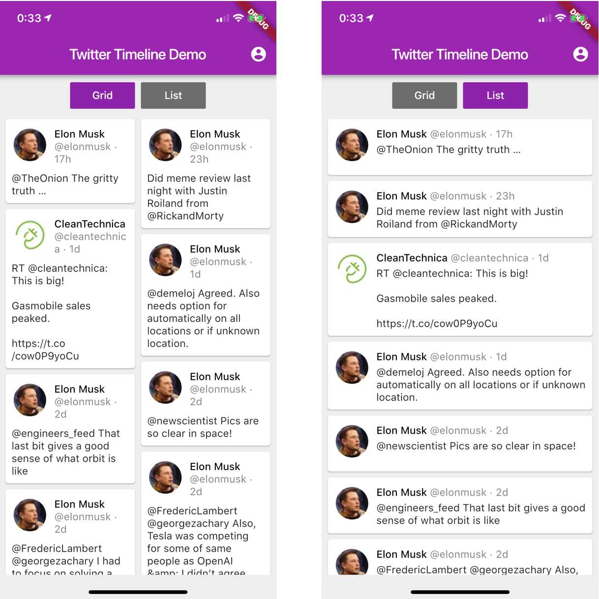
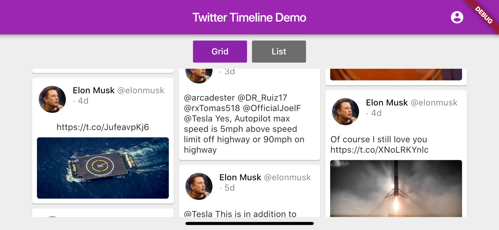

# Flutter Twitter Timeline Demo App

A simple demo application created using Flutter.
It just loads and displays Twitter user's timeline. 

Key features:

- Multi-column tweet list rendering (pull-to-refresh, infinite list, rotation, etc);
- Custom Flutter plugin for the following tasks:
    - Device interface orientation notification subscriptions,
    - Getting Twitter raw JSON responses (a native TwitterKit SDK is used)
- BLoC Architecture
   
A note: Currently, the plugin is implemented for iOS only.

